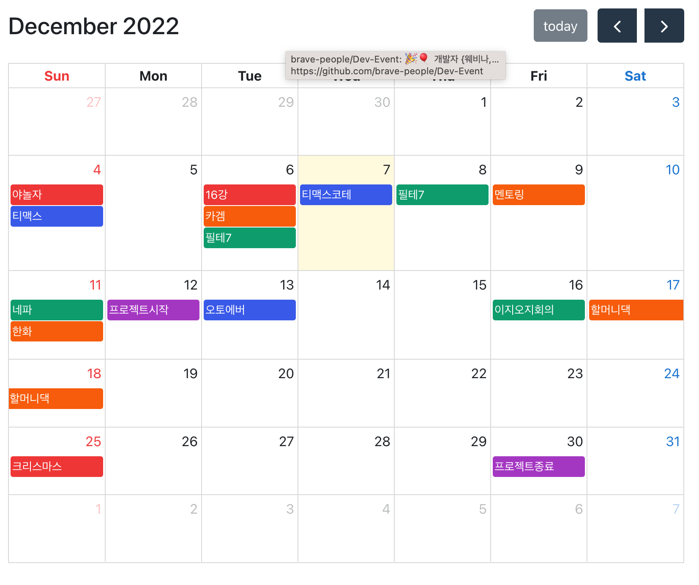

# 개인 일정 캘린더 웹

개인 일정들을 한눈에 확인이 가능하도록 개발

### Client

### Server

 

 

## 상세 기능

- AWS EC2를 활용하여 배포
- React.js 클라이언트, Node.js 서버 개발
- axios를 통해 api 통신
- CRUD 중 Create, Read 기능 구현
- MongoDB를 활용하여 데이터를 편리하게 저장 및 관리
- 웹, 모바일 반응형 개발
- React Full Calendar 라이브러리 활용

## Screen

